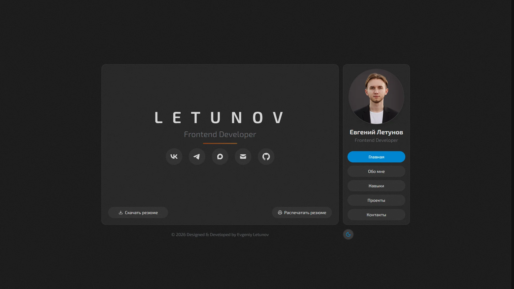
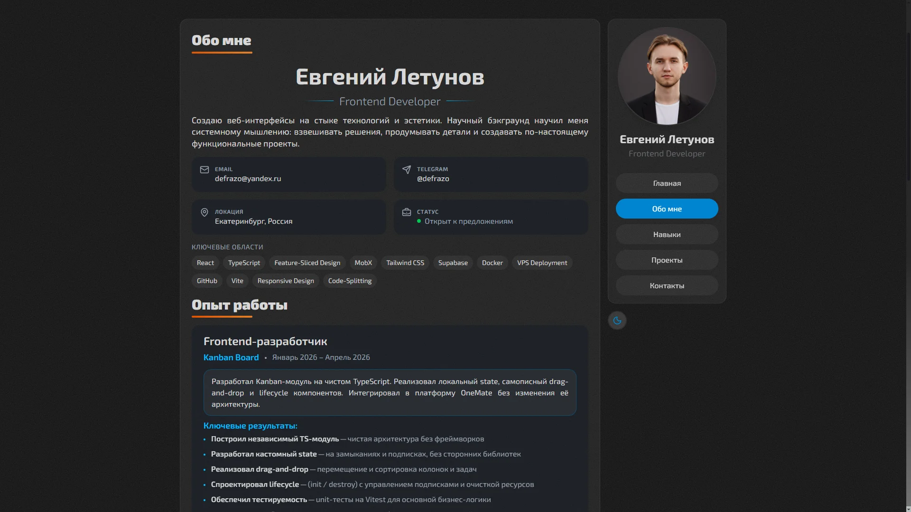
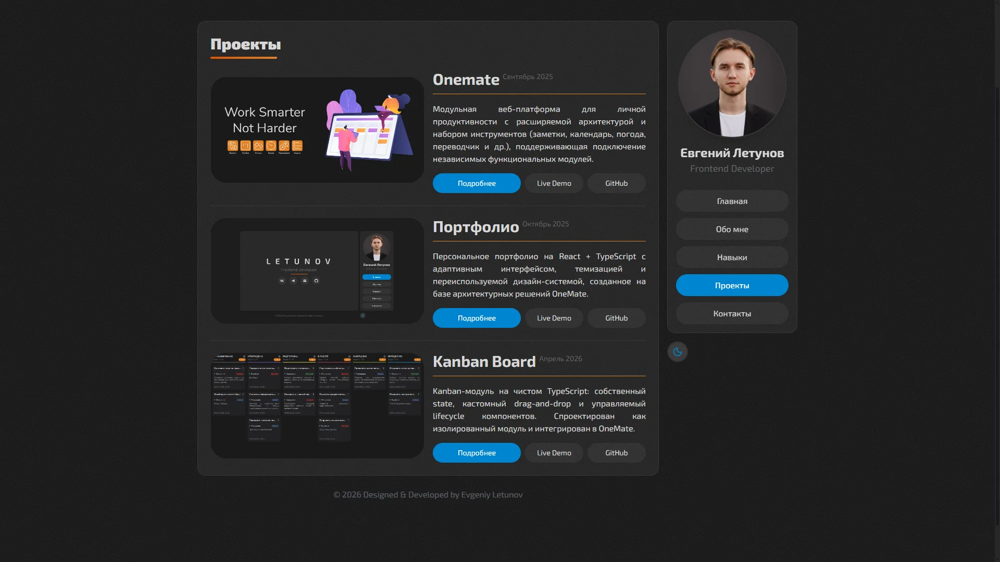

     

# Портфолио разработчика – Евгений Летунов

Современное портфолио Frontend-разработчика, созданное как самостоятельный продукт – с архитектурой, удобным UI и возможностью легко расширять функциональность.

## О проекте

**Портфолио** – это не просто визитка, а демонстрация подхода к разработке: структура, код, UX и внимание к деталям.

> [!IMPORTANT]
> Посмотреть проект в деле:
>
> 
>

## Технологический стек

Проект построен на современном, производительном и модульном стеке:

- **React** + **TypeScript** – компонентный подход с безопасной типизацией;
- **FSD (Feature-Sliced Design)** – четкое разделение ответственности и масштабируемая структура;
- **Tailwind CSS** – единый визуальный стиль и быстрая адаптивная верстка;
- **MobX** – реактивное управление состоянием с лаконичным синтаксисом;
- **Vite** – молниеносная сборка и удобная разработка;

## Что внутри?

**Унифицированный интерфейс с акцентом на UX:**

- адаптация под устройства от iPhone SE до 2K-мониторов;
- кроссбраузерная поддержка и корректная работа на touch-устройствах;
- современный интерфейс с возможностью выбора темы (dark/light mode).

**5 информационных табов**:

- "Home" – приветствие, краткая информация и быстрые ссылки.
- "About" – информация о разработчике, образовании и профессиональном пути.
- "Skills" – шкалы навыков с визуальной оценкой уровня владения.
- "Projects" – галерея реальных проектов с описаниями и ссылками.
- "Contacts" – все способы связи в одном месте.

**1 универсальная страница с детальной информацией о проекте**

- Название и краткое описание проекта;
- Краткое описание задачи и применённого решения;
- Галереи изображений (отдельно Desktop и Mobile);
- Список использованных в разработке технологий;
- Дополнительные детали о проекте (вариативно).

## Скриншоты

  
Показать

   

    
     
    
     
    
  

## Автор

> [!TIP]
>
> #### Евгений Летунов
>
>  
