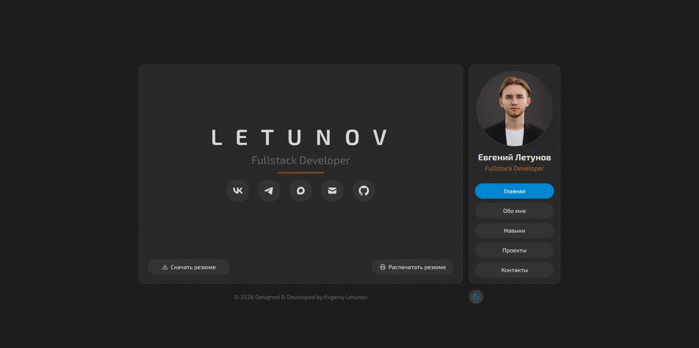
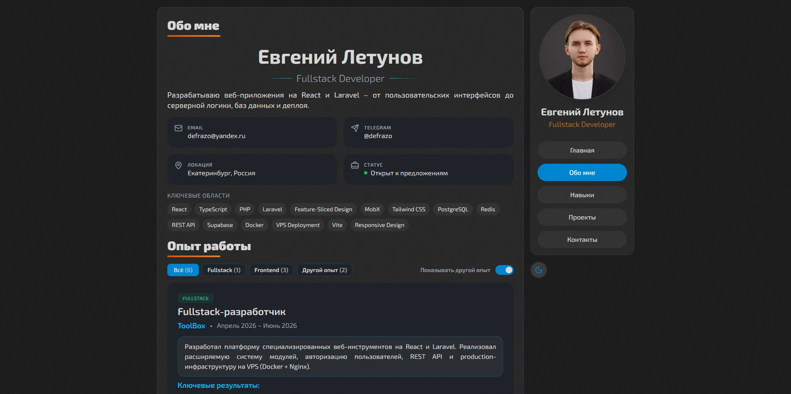
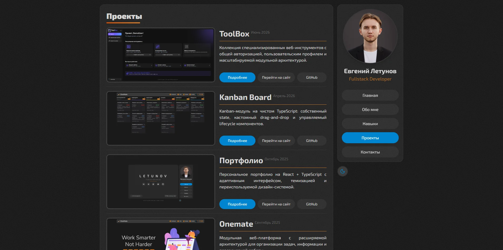
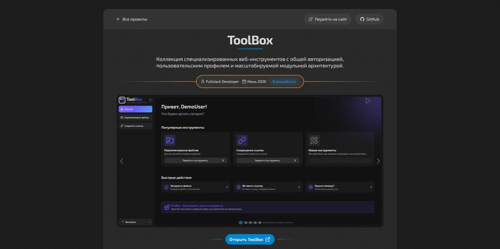

     

# LETUNOV – цифровая визитка Fullstack-разработчика

**LETUNOV** – персональный сайт-портфолио, реализованный как самостоятельный продукт: с собственной архитектурой, удобным UI и возможностью легко расширять функциональность.

> [!IMPORTANT]
>
> Посмотреть проект в деле:
>
> 

## Технологический стек

### Frontend

- **React** + **TypeScript** – компонентная архитектура и строгая типизация;
- **FSD (Feature-Sliced Design)** – четкое разделение ответственности и масштабируемая структура;
- **Tailwind CSS** – единый визуальный стиль и быстрая адаптивная вёрстка;
- **MobX** – реактивное управление состоянием с лаконичным синтаксисом;
- **Vite** – быстрый запуск и оптимизированная сборка.

### DevOps & Infrastructure

- **Docker** – контейнеризация приложений и унификация окружения;
- **Docker Compose** – управление многоконтейнерной инфраструктурой;
- **Nginx** – reverse proxy и раздача приложений;
- **VPS** – деплой и администрирование проекта.

## Возможности

- адаптивный интерфейс для любых экранов и устройств (от iPhone SE до 2K-мониторов);
- кроссбраузерная совместимость и корректная работа на touch-устройствах;
- светлая и тёмная тема.

## Разделы

**Информационные табы** – разделы с информацией о разработчике.

- **Home** – приветствие, краткая информация и быстрые ссылки;
- **About** – информация о разработчике, образовании и профессиональном пути;
- **Skills** – шкалы навыков с визуальной оценкой уровня владения;
- **Projects** – галерея реальных проектов с описаниями и ссылками;
- **Contacts** – все способы связи в одном месте.

**Страница проекта** – детальная карточка с информацией о конкретном проекте.

- название и краткое описание проекта;
- задача и применённое решение;
- отдельные галереи изображений для desktop и mobile;
- список использованных технологий;
- дополнительные детали о проекте (опционально).

## Скриншоты

  
Показать

   

    
     
    
     
    
     
    
  

## Автор

> [!TIP]
>
> #### Евгений Летунов
>
>  
